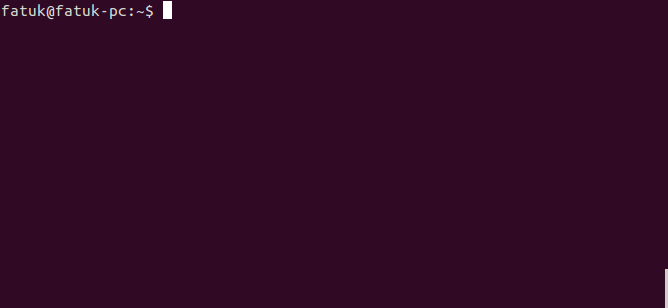

# recrec
Bash script to run byzanz a screen recorder with ease

## Installing

Just place this script to `~/bin`.
And it will be available in terminal with `recrec`.
Check it out `recrec --help`.

## Available options:

| description          |                                    |
| :------------------- | :------                            |
| `-h` or `--help`     | help screen                        |
| `-name`              | set custom name for output file    |
| `-ext`               | set extension (gif, flv, ogg, ogv) |
| `-del`               | set delay before start recording   |
| `-dur`               | set recording duration             |

## How to use:

1. Type somothing like that in your terminal: `recrec -name test-cast -ext gif -del 3 -dur 15`
2. Choose window you want to record by clicking on it
3. Wait your delay before record, maybe you'll here some BEEP, if you make sound in your speakers more loud)
4. Do some stuff
5. And you have cool gif

## IMPORTANT Notes:

1. You need [xwininfo](http://manpages.ubuntu.com/manpages/hardy/man1/xwininfo.1.html) to get a window info.
2. You need [byzanz-record](http://manpages.ubuntu.com/manpages/oneiric/man1/byzanz-record.1.html), actually a recording app

## Thanks to this [gist](https://gist.github.com/lucy/3042755).

